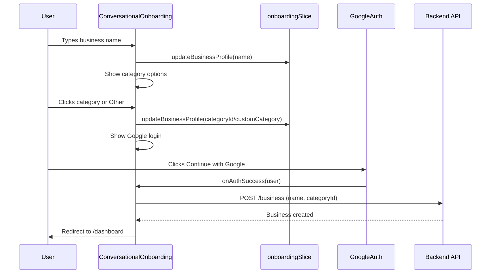

# Phase 1.1 - Conversational Onboarding

**Created:** December 13, 2024  
**Completed:** December 15, 2024  
**Status:** ✅ COMPLETE

---

## Overview

Replace the current 3-step wizard onboarding with a conversational chat-style experience inspired by Claude.ai. Messages appear sequentially like a chat, users respond by typing or clicking options. This reduces friction from 3 steps to a single fluid conversation.

**What we collect:**
- Business name (required)
- Category (optional) - with "Other" allowing custom text
- Google authentication (required)

---

## User Experience

### Main Flow

```
┌─────────────────────────────────────────────────────────────────┐
│  [BookEasy Logo]                                                │
├─────────────────────────────────────────────────────────────────┤
│                                                                 │
│     ┌─────────────────────────────────────────────────────┐     │
│     │  👋 Hi! Let's create your booking page.             │     │
│     │     What's your business called?                    │     │
│     └─────────────────────────────────────────────────────┘     │
│                                                                 │
│     ┌─────────────────────────────────────────────────────┐     │
│     │  Sarah's Salon                                    → │     │
│     └─────────────────────────────────────────────────────┘     │
│                                                                 │
│     ┌─────────────────────────────────────────────────────┐     │
│     │  Nice! What type of business is Sarah's Salon?      │     │
│     │  (This helps personalize your experience)           │     │
│     └─────────────────────────────────────────────────────┘     │
│                                                                 │
│     ┌──────────┐  ┌──────────┐  ┌──────────┐  ┌──────────┐     │
│     │ 💇 Beauty│  │ 💪 Health│  │ 🧘 Wellness│ │ ✨ Other │     │
│     └──────────┘  └──────────┘  └──────────┘  └──────────┘     │
│                                                                 │
│                        [ Skip this ]                            │
│                                                                 │
│     ┌─────────────────────────────────────────────────────┐     │
│     │  Perfect! Let's save your booking page.             │     │
│     └─────────────────────────────────────────────────────┘     │
│                                                                 │
│              [🔵 Continue with Google]                          │
│                                                                 │
└─────────────────────────────────────────────────────────────────┘
```

### "Other" Category Flow

When user clicks "Other", show an input field:

```
│     ┌─────────────────────────────────────────────────────┐     │
│     │  What would you call your business type?            │     │
│     └─────────────────────────────────────────────────────┘     │
│     ┌─────────────────────────────────────────────────────┐     │
│     │  Music lessons                                    → │     │
│     └─────────────────────────────────────────────────────┘     │
```

---

## Data Flow



---

## Technical Approach

### Keep Existing Code
- Existing onboarding files in `components/onboarding/` remain untouched
- New component: `components/ConversationalOnboarding/`
- Replace component used in `pages/onboarding/index.tsx`

### Component Structure

```
frontend/src/components/ConversationalOnboarding/
├── index.tsx                    # Main export
├── ConversationalOnboarding.tsx # Main component with state machine
├── ChatMessage.tsx              # Bot message bubble
├── ChatInput.tsx                # Text input with submit
├── CategoryGrid.tsx             # Grid of category buttons
└── useConversationFlow.ts       # Hook managing conversation state
```

---

## Files to Modify

| File | Changes |
|------|---------|
| `frontend/src/pages/onboarding/index.tsx` | Replace wizard with ConversationalOnboarding component |
| `frontend/src/store/slices/onboardingSlice.ts` | Add `categoryId` and `customCategory` fields to state |
| `frontend/src/types/business.types.ts` | Add `categoryId?` and `customCategory?` to CreateBusinessRequest |
| `backend/src/business/dto/create-business.dto.ts` | Add optional `businessTypeId` and `customCategory` fields |
| `backend/src/business/business.service.ts` | Handle `businessTypeId` and `customCategory` in create method |

---

## Files to Create

| File | Purpose |
|------|---------|
| `frontend/src/components/ConversationalOnboarding/index.tsx` | Main export |
| `frontend/src/components/ConversationalOnboarding/ConversationalOnboarding.tsx` | Main component with conversation flow |
| `frontend/src/components/ConversationalOnboarding/ChatMessage.tsx` | Bot message bubble with typing animation |
| `frontend/src/components/ConversationalOnboarding/ChatInput.tsx` | Input field for user responses |
| `frontend/src/components/ConversationalOnboarding/CategoryGrid.tsx` | Grid of category option buttons |
| `frontend/src/components/ConversationalOnboarding/useConversationFlow.ts` | Hook managing step transitions |

---

## Dependencies

**None** - use existing dependencies:
- Chakra UI for styling
- Framer Motion for animations (already installed)
- RTK Query hooks (`useGetBusinessCategoriesQuery`, `useCreateBusinessMutation`)

---

## Implementation Steps

### Step 1: Backend - Add category support to CreateBusinessDto
**File:** `backend/src/business/dto/create-business.dto.ts`

Add these optional fields:
```typescript
@IsOptional()
@IsNumber()
businessTypeId?: number;

@IsOptional()
@IsString()
@MaxLength(100)
customCategory?: string;
```

### Step 2: Backend - Update BusinessService.create()
**File:** `backend/src/business/business.service.ts`

In the create method, save the new fields:
```typescript
business.businessTypeId = createBusinessDto.businessTypeId || null;
// Store customCategory in a new field or handle as needed
```

### Step 3: Frontend - Update types and Redux slice
**Files:** 
- `frontend/src/types/business.types.ts`
- `frontend/src/store/slices/onboardingSlice.ts`

Add to BusinessProfile and CreateBusinessRequest:
```typescript
categoryId?: number;
customCategory?: string;
```

### Step 4: Frontend - Create ChatMessage component
**File:** `frontend/src/components/ConversationalOnboarding/ChatMessage.tsx`

Features:
- Bot avatar + message bubble
- Typing indicator animation (3 dots with staggered bounce)
- Entrance animation (fade + slide up)

```tsx
interface ChatMessageProps {
  children: React.ReactNode;
  isTyping?: boolean;
  delay?: number;
}
```

### Step 5: Frontend - Create ChatInput component
**File:** `frontend/src/components/ConversationalOnboarding/ChatInput.tsx`

Features:
- Text input with submit button (arrow icon)
- Enter key to submit
- Auto-focus on mount
- Disabled state while submitting

```tsx
interface ChatInputProps {
  placeholder?: string;
  onSubmit: (value: string) => void;
  isDisabled?: boolean;
}
```

### Step 6: Frontend - Create CategoryGrid component
**File:** `frontend/src/components/ConversationalOnboarding/CategoryGrid.tsx`

Features:
- Fetch categories from API (`useGetBusinessCategoriesQuery`)
- Grid of buttons with emoji icons
- "Other" button that reveals text input
- "Skip" link below grid

```tsx
interface CategoryGridProps {
  onSelect: (categoryId: number | null, customCategory?: string) => void;
  onSkip: () => void;
}
```

### Step 7: Frontend - Create useConversationFlow hook
**File:** `frontend/src/components/ConversationalOnboarding/useConversationFlow.ts`

State machine with states:
- `askName` - Initial state, show name input
- `askCategory` - Show category grid
- `showOther` - Show custom category input
- `showAuth` - Show Google login button
- `creating` - Creating business (loading)
- `error` - Error state

```tsx
type ConversationStep = 'askName' | 'askCategory' | 'showOther' | 'showAuth' | 'creating' | 'error';

interface ConversationState {
  step: ConversationStep;
  businessName: string;
  categoryId: number | null;
  customCategory: string;
  messages: Message[];
}
```

### Step 8: Frontend - Create ConversationalOnboarding component
**File:** `frontend/src/components/ConversationalOnboarding/ConversationalOnboarding.tsx`

Features:
- Renders chat messages sequentially
- Auto-scrolls to latest message
- Uses `useConversationFlow` hook
- Handles Google auth success
- Creates business via API
- Redirects to `/dashboard` on success

### Step 9: Frontend - Update onboarding page
**File:** `frontend/src/pages/onboarding/index.tsx`

- Import and render `ConversationalOnboarding`
- Keep existing wizard code (commented or rename to `OnboardingPageLegacy`)
- Maintain same route `/onboarding`

---

## Testing Checklist

- [ ] User can enter business name and proceed
- [ ] Category buttons display correctly (fetched from API)
- [ ] Clicking a category proceeds to auth step
- [ ] "Other" reveals custom input field
- [ ] Custom category text is saved correctly
- [ ] "Skip" bypasses category selection
- [ ] Google login works and triggers business creation
- [ ] Business is created with correct categoryId/customCategory
- [ ] Redirect to `/dashboard` after creation
- [ ] Mobile responsive (stacked layout, full-width inputs)
- [ ] Animations are smooth (typing indicator, message entrance)
- [ ] Error states handled gracefully (API failures, auth failures)
- [ ] Empty business name shows validation error
- [ ] Already authenticated users see correct flow

---

## Design Notes

### Visual Style
- Clean white background with subtle gray chat bubbles
- Bot messages: Left-aligned, gray background (`gray.50`)
- Category buttons: Outline style with emoji icon, hover fills with `brand.50`
- Use existing `brand.500` for accents and primary actions

### Animations
- Messages appear with `fadeIn` + slight `slideUp` (0.3s ease-out)
- Typing indicator: 3 dots with staggered bounce animation
- Category buttons: `scale(1.02)` on hover
- Smooth scroll to new messages using `scrollIntoView({ behavior: 'smooth' })`

### Typography
- Bot messages: `md` size, `gray.700` color
- Headings in messages: `lg` size, `gray.900` color, `600` weight
- Category buttons: `sm` size, `500` weight
- Skip link: `sm` size, `gray.500` color

### Spacing
- Message gap: `16px` (4 in Chakra)
- Category grid gap: `12px` (3 in Chakra)
- Container: `maxW="500px"` centered with `px={4}` on mobile

### Mobile Considerations
- Full-width inputs on mobile
- Category grid: 2 columns on mobile, 4 on desktop
- Adequate touch targets (min 44px height for buttons)

---

## Out of Scope

- Chat history persistence (messages are session-only)
- Redirect to `/chat` (will be done in Phase 1.2)
- AI-generated responses (this is static conversational UI)
- Multiple business creation
- Email/password authentication (Google only)

